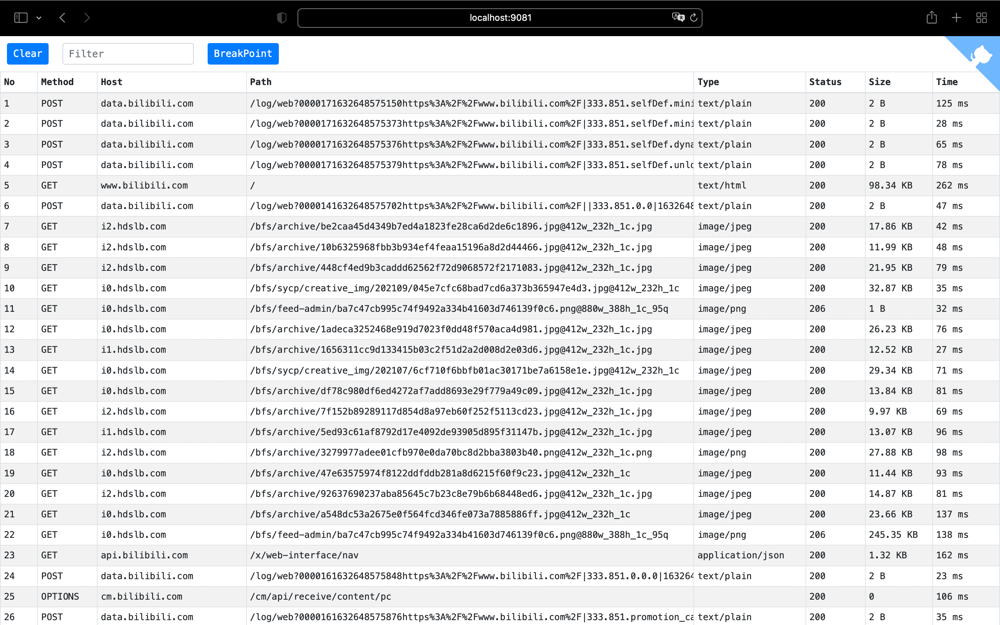
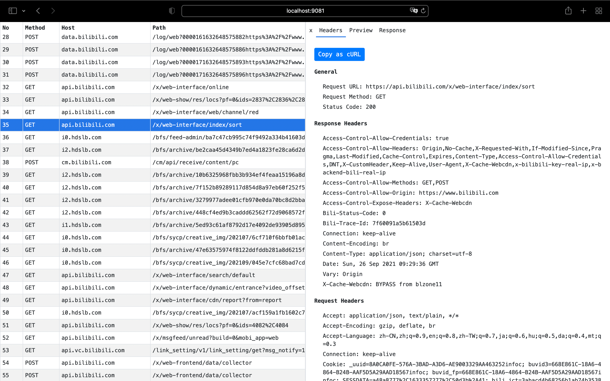
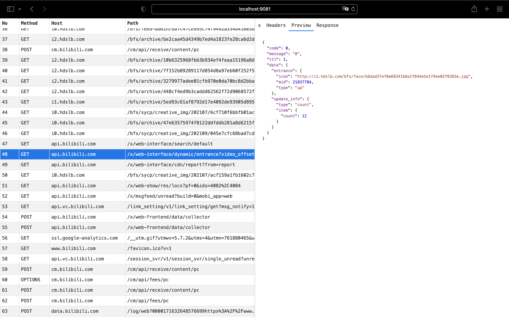

<p align="center">
  
</p>
<p align="center">🎉Proxy Plugin of Sonic cloud real machine platform</p>
<p align="center">
  <span>English |</span>
  <a href="https://github.com/SonicCloudOrg/sonic-go-mitmproxy/blob/main/README_CN.md">  
     简体中文
  </a>
</p>

This repo was fork from [go-mitmproxy](https://github.com/lqqyt2423/go-mitmproxy).
We will optimize and customize based on this, and we will also provide our pr to the original repo.

### Official Website
[Sonic Official Website](https://sonic-cloud.gitee.io)
## Background

#### What is sonic ?

> Sonic is a platform that integrates remote control debugging and automated testing of mobile devices, and strives to create a better use experience for global developers and test engineers.
>
>If you want to participate, welcome to join us! 💪
>
>If you want to support, you can give me a star. ⭐


## Features

- Intercept HTTP & HTTPS requests and responses and modify them on the fly
- SSL/TLS certificates for interception are generated on the fly
- Addon mechanism, you can add your functions easily, refer to [addon/addon.go](./addon/addon.go)
- Performance advantages
  - Golang's inherent performance advantages
  - Forwarding and parsing HTTPS traffic in process memory without inter-process communication such as tcp port or unix socket
  - Use LRU cache when generating certificates of different domain names to avoid double counting
- Support `Wireshark` to analyze traffic through the environment variable `SSLKEYLOGFILE`
- Support streaming when uploading/downloading large files
- Web interface

## Usage

### Startup

```
sonic-go-mitmproxy
```

After startup, the HTTP proxy address defaults to port 9080, and the web interface defaults to port 9081.

After the first startup, the SSL/TLS certificate will be automatically generated at `~/.mitmproxy/sonic-go-mitmproxy-ca-cert.pem`. You can refer to this link to install: [About Certificates](https://docs.mitmproxy.org/stable/concepts-certificates/).

### Help

```
Usage of sonic-go-mitmproxy:
  -addr string
    	proxy listen addr (default ":9080")
  -dump string
    	dump filename
  -dump_level int
    	dump level: 0 - header, 1 - header + body
  -mapper_dir string
    	mapper files dirpath
  -ssl_insecure
    	not verify upstream server SSL/TLS certificates.
  -version
    	show version
  -web_addr string
    	web interface listen addr (default ":9081")
  -cert_path string
    	path of generate cert files
```

## Usage as package

Refer to [cmd/go-mitmproxy/main.go](./cmd/go-mitmproxy/main.go), you can add your own addon by call `AddAddon` method.

For more examples, please refer to [examples](./examples)

## Web interface







## TODO

- [ ] Support http2
- [ ] Support parse websocket

## License

[MIT License](./LICENSE)
