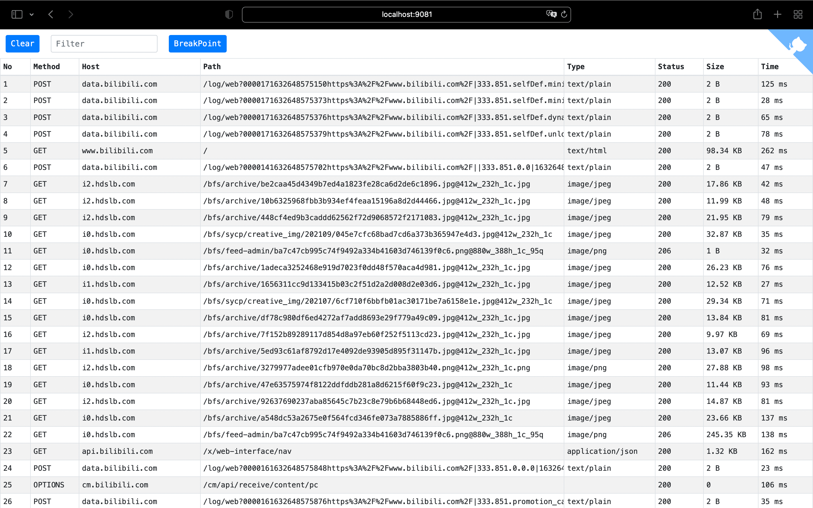

<p align="center">
  
</p>
<p align="center">🎉Sonic云真机测试平台代理插件</p>
<p align="center">
<a href="https://github.com/SonicCloudOrg/sonic-go-mitmproxy/blob/main/README.md">  
    English
  </a>
  <span>| 简体中文</span>
</p>

本仓库从 [go-mitmproxy](https://github.com/lqqyt2423/go-mitmproxy) Fork，我们将基于此进行优化与定制，也会给原仓库提供我们的优化pr。

### 官方网站
[Sonic Official Website](http://sonic-cloud.gitee.io)
## 背景

#### 什么是Sonic？

> 如今，自动化测试、远程控制等技术已经逐渐成熟。其中 [Appium](https://github.com/appium/appium) 在自动化领域可以说是领头者，[STF](https://github.com/openstf/stf) 则是远程控制的始祖。很久前就开始有了一个想法，是否可以在一个平台上，提供解决所有客户端（Android、iOS、Windows、Mac、Web应用）的测试方案，于是，Sonic云真机测试平台由此诞生。

#### 愿景

> Sonic当前的愿景是能帮助中小型企业解决在客户端自动化或远控方面缺少工具和测试手段的问题。
>
>  如果你想参与其中，欢迎加入！💪
>
> 如果你想支持，可以给我一个star。⭐


## 特点

- HTTPS 证书相关逻辑参考 [mitmproxy](https://mitmproxy.org/) 且与之兼容，根证书也保存在 `~/.mitmproxy` 文件夹中，如果之前用过 `mitmproxy`
  且根证书已经安装信任，则此 `go-mitmproxy` 可以直接使用
- 支持插件机制，很方便扩展自己需要的功能，可参考 [addon/addon.go](./addon/addon.go)
- 性能优势
    - Golang 天生的性能优势
    - 在进程内存中转发解析 HTTPS 流量，不需通过 tcp端口 或 unix socket 等进程间通信
    - 生成不同域名证书时使用 LRU 缓存，避免重复计算
- 通过环境变量 `SSLKEYLOGFILE` 支持 `Wireshark` 解析分析流量
- 上传/下载大文件时支持流式传输
- Web 界面

## 命令行使用

### 启动

```
sonic-go-mitmproxy
```

启动后，HTTP 代理地址默认为 9080 端口，Web 界面默认在 9081 端口。

首次启动后需按照证书以解析 HTTPS 流量，证书会在首次启动命令后自动生成，路径为 `~/.mitmproxy/sonic-go-mitmproxy-ca-cert.pem`
。可参考此链接安装：[About Certificates](https://docs.mitmproxy.org/stable/concepts-certificates/)。

### 自定义参数

```
Usage of sonic-go-mitmproxy:
  -addr string
    	proxy listen addr (default ":9080")
  -dump string
    	dump filename
  -dump_level int
    	dump level: 0 - header, 1 - header + body
  -mapper_dir string
    	mapper files dirpath
  -ssl_insecure
    	not verify upstream server SSL/TLS certificates.
  -version
    	show version
  -web_addr string
    	web interface listen addr (default ":9081")
  -cert_path string
    	path of generate cert files
```

## 作为包引入

参考 [cmd/go-mitmproxy/main.go](./cmd/go-mitmproxy/main.go)，可通过自己实现 `AddAddon` 方法添加自己实现的插件。

更多示例可参考 [examples](./examples)

## Web 界面




## TODO

- [ ] 支持 http2 协议
- [ ] 支持解析 websocket

## License

[MIT License](./LICENSE)
